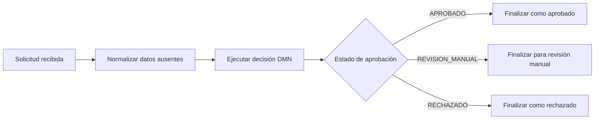

# Evaluación de crédito con Kogito

Implementación de un proceso de evaluación crediticia con Spring Boot, Kogito, BPMN y DMN. El proceso recibe una solicitud, prepara los datos de entrada, ejecuta una decisión de negocio y finaliza en uno de estos estados:

- `APROBADO`
- `REVISION_MANUAL`
- `RECHAZADO`

La solución mantiene la orquestación en BPMN y la política crediticia en DMN. El código Java se limita al modelo de dominio, la validación estructural y la normalización necesaria para que los datos incompletos puedan evaluarse de forma controlada.

## Ejecución

Ejecutar la compilación y todas las pruebas:

```bash
mvn clean test
```

Iniciar la aplicación:

```bash
mvn spring-boot:run
```

La aplicación queda disponible en `http://localhost:8080`.

## API de evaluación

Kogito genera el endpoint a partir de `src/main/resources/credit-approval.bpmn2`:

```text
POST /creditApproval
Content-Type: application/json
Accept: application/json
```

### Solicitud

```bash
curl --request POST 'http://localhost:8080/creditApproval' \
  --header 'Content-Type: application/json' \
  --header 'Accept: application/json' \
  --data '{
    "customerId": "CUST-001",
    "creditScore": 720,
    "monthlyIncome": 2500,
    "monthlyDebt": 600,
    "requestedAmount": 10000,
    "fraudConfirmed": false
  }'
```

### Respuesta

Una evaluación válida devuelve `201 Created`, un encabezado `Location` y las variables de la instancia del proceso:

```json
{
  "id": "<process-instance-id>",
  "customerId": "CUST-001",
  "creditScore": 720,
  "monthlyIncome": 2500,
  "monthlyDebt": 600,
  "requestedAmount": 10000,
  "fraudConfirmed": false,
  "debtRatio": 0.24,
  "inputValid": true,
  "approvalStatus": "REVISION_MANUAL",
  "decisionReason": "REVISION_REQUERIDA"
}
```

Los nombres técnicos de las variables `approvalStatus` y `decisionReason` se conservan para mantener el contrato generado por Kogito. Sus valores de negocio están en español y se transportan en mayúsculas, sin tildes, para que sean estables como identificadores de API.

Los datos inválidos o incompletos no se tratan como un error HTTP de negocio. Por ejemplo, `{}` finaliza como `RECHAZADO` con razón `DATOS_INVALIDOS`, sin dividir entre cero ni lanzar una excepción del motor.

## Ejemplos de evaluación

Todos los ejemplos se envían al mismo endpoint y devuelven `201 Created`. El resultado se encuentra en `approvalStatus` y el motivo en `decisionReason`.

### Aprobación automática

Este caso verifica el límite exacto de score `750` y ratio de deuda de `35%`:

```bash
curl --request POST 'http://localhost:8080/creditApproval' \
  --header 'Content-Type: application/json' \
  --data '{
    "customerId": "CUST-AP-001",
    "creditScore": 750,
    "monthlyIncome": 2500,
    "monthlyDebt": 875,
    "requestedAmount": 10000,
    "fraudConfirmed": false
  }'
```

Resultado esperado:

```json
{
  "approvalStatus": "APROBADO",
  "decisionReason": "APROBACION_AUTOMATICA",
  "debtRatio": 0.35
}
```

### Revisión manual

Este caso verifica el límite inferior del rango manual, `creditScore = 650`:

```bash
curl --request POST 'http://localhost:8080/creditApproval' \
  --header 'Content-Type: application/json' \
  --data '{
    "customerId": "CUST-RM-001",
    "creditScore": 650,
    "monthlyIncome": 2500,
    "monthlyDebt": 600,
    "requestedAmount": 10000,
    "fraudConfirmed": false
  }'
```

Resultado esperado:

```json
{
  "approvalStatus": "REVISION_MANUAL",
  "decisionReason": "REVISION_REQUERIDA",
  "debtRatio": 0.24
}
```

El límite superior, `creditScore = 749`, produce el mismo estado `REVISION_MANUAL`.

### Rechazo por política crediticia

Un score inferior a `650` se rechaza por política:

```bash
curl --request POST 'http://localhost:8080/creditApproval' \
  --header 'Content-Type: application/json' \
  --data '{
    "customerId": "CUST-RJ-001",
    "creditScore": 649,
    "monthlyIncome": 2500,
    "monthlyDebt": 600,
    "requestedAmount": 10000,
    "fraudConfirmed": false
  }'
```

Resultado esperado:

```json
{
  "approvalStatus": "RECHAZADO",
  "decisionReason": "POLITICA_CREDITICIA_NO_CUMPLIDA",
  "debtRatio": 0.24
}
```

### Fraude confirmado

El fraude tiene prioridad, incluso si la solicitud cumpliría los criterios de aprobación:

```bash
curl --request POST 'http://localhost:8080/creditApproval' \
  --header 'Content-Type: application/json' \
  --data '{
    "customerId": "CUST-FR-001",
    "creditScore": 800,
    "monthlyIncome": 3000,
    "monthlyDebt": 600,
    "requestedAmount": 10000,
    "fraudConfirmed": true
  }'
```

Resultado esperado:

```json
{
  "approvalStatus": "RECHAZADO",
  "decisionReason": "FRAUDE_CONFIRMADO"
}
```

### Datos incompletos o inválidos

Una solicitud vacía se procesa de forma controlada y no devuelve `400 Bad Request`:

```bash
curl --request POST 'http://localhost:8080/creditApproval' \
  --header 'Content-Type: application/json' \
  --data '{}'
```

Resultado esperado:

```json
{
  "approvalStatus": "RECHAZADO",
  "decisionReason": "DATOS_INVALIDOS",
  "debtRatio": null
}
```

De igual forma, `monthlyIncome = 0` se rechaza como `DATOS_INVALIDOS` y no intenta calcular el ratio de deuda.

## Estados y razones

### Estados

| Valor | Significado |
|---|---|
| `APROBADO` | La solicitud cumple las condiciones de aprobación automática. |
| `REVISION_MANUAL` | La solicitud requiere análisis adicional según la política. |
| `RECHAZADO` | La solicitud no puede aprobarse automáticamente o contiene datos inválidos. |

### Razones

| Valor | Significado |
|---|---|
| `APROBACION_AUTOMATICA` | Cumple los criterios de aprobación automática. |
| `REVISION_REQUERIDA` | Debe ser revisada manualmente según la política. |
| `POLITICA_CREDITICIA_NO_CUMPLIDA` | No cumple los criterios de aprobación. |
| `FRAUDE_CONFIRMADO` | Existe fraude confirmado; esta razón tiene prioridad. |
| `DATOS_INVALIDOS` | Faltan datos o algún valor no cumple las restricciones estructurales. |

## Reglas de negocio

La tabla DMN utiliza la hit policy `FIRST`: las reglas se evalúan en orden y se devuelve el primer resultado aplicable.

| Prioridad | Condición | Resultado |
|---:|---|---|
| 1 | `fraudConfirmed = true` | `RECHAZADO` |
| 2 | `inputValid = false` | `RECHAZADO` |
| 3 | score `>= 750`, ingreso `>= 1500` y ratio `<= 35%` | `APROBADO` |
| 4 | score entre `650` y `749` | `REVISION_MANUAL` |
| 5 | score `< 650` | `RECHAZADO` |
| 6 | score `>= 750` sin cumplir la aprobación automática | `REVISION_MANUAL` |

La última regla hace explícito el supuesto de negocio para un score alto que no cumple el ingreso mínimo o el límite de endeudamiento: se deriva a revisión manual en lugar de rechazarse automáticamente.

Fraude se evalúa antes que cualquier otra condición. Por eso un fraude confirmado conserva el resultado `RECHAZADO` y la razón `FRAUDE_CONFIRMADO`, incluso cuando el resto de los datos es inválido.

## Arquitectura del proceso



### BPMN

`credit-approval.bpmn2` coordina el flujo:

1. Recibe la solicitud mediante el evento inicial.
2. Normaliza los valores ausentes antes de invocar el motor de decisiones.
3. Ejecuta la decisión DMN `credit-approval` mediante un Business Rule Task.
4. Enruta la instancia con un gateway exclusivo según `approvalStatus`.
5. Finaliza en una de las tres rutas de negocio.

### DMN y FEEL

`credit-approval.dmn` contiene las decisiones:

- `inputValid`: valida identificador, score, ingresos, deuda, monto solicitado y fraude.
- `debtRatio`: calcula `monthlyDebt / monthlyIncome` únicamente cuando el ingreso es mayor que cero.
- `approvalStatus`: determina el estado usando la tabla de reglas y `FIRST`.
- `decisionReason`: devuelve una explicación estable sin duplicar la política principal.

La política no está duplicada en Java ni en BPMN. Esto permite modificar los criterios de crédito en DMN sin convertir el proceso en una colección de condiciones imperativas.

## Modelo Java y normalización

- `CreditApplication` es un `record` inmutable que concentra la validación estructural y el cálculo seguro de `debtRatio`.
- `CreditApplicationNormalizer` convierte valores ausentes en sentinelas controlados (`""`, `-1`, `0` o `false`) para que DMN pueda evaluar solicitudes incompletas.
- `CreditApprovalStatus` define los tres estados públicos del proceso.
- `CreditDecisionReason` define las razones públicas de la decisión.

La normalización no decide si una solicitud es válida. Solo evita errores técnicos; la decisión `inputValid` sigue determinando si los datos cumplen las reglas de negocio.

## Pruebas

La suite usa dos niveles de verificación:

- Pruebas unitarias para el modelo y el normalizador.
- Pruebas de integración HTTP con el endpoint generado por Kogito.

Se cubren los siguientes escenarios:

- Aprobación con score `750` y ratio exacto de `35%`.
- Límites de revisión manual `650` y `749`.
- Rechazo con score `649`.
- Score alto con ratio de deuda desfavorable.
- Fraude confirmado con datos aprobables.
- Fraude confirmado junto con datos inválidos.
- Ingreso cero sin división inválida.
- Solicitud incompleta `{}`.

Ejecutar la suite completa con:

```bash
mvn clean test
```

## Decisiones técnicas

- Se utiliza el endpoint REST generado por Kogito para mantener el foco en BPMN y DMN, sin agregar una capa REST paralela.
- `FIRST` expresa de forma explícita la prioridad de fraude y de datos inválidos.
- La normalización ocurre en un paso visible del BPMN para separar la preparación técnica de la validación semántica.
- No se usa persistencia, autenticación ni frontend porque no forman parte del alcance de la prueba.
- No se utiliza CORS global; el servicio no expone una aplicación web que requiera esa política.
