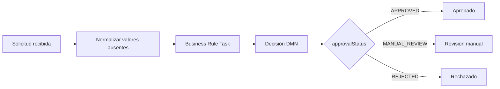

# Credit approval con Kogito

Ejemplo completo de una evaluación de crédito implementada con Spring Boot, Kogito, BPMN y DMN. El proceso recibe una solicitud, normaliza valores ausentes, ejecuta la decisión DMN y finaliza en una de tres rutas: `APPROVED`, `MANUAL_REVIEW` o `REJECTED`.

La versión de Kogito utilizada es `10.2.0`, con Java 17 como nivel de compilación y Spring Boot 3.5.10.

## Ejecutar el proyecto

Requisitos:

- JDK 17 o superior.
- Maven 3.9 o superior.

Compilar y ejecutar todas las pruebas:

```bash
mvn clean test
```

Iniciar la aplicación:

```bash
mvn spring-boot:run
```

Kogito genera el endpoint REST del proceso a partir de `credit-approval.bpmn2`:

```text
POST http://localhost:8080/creditApproval
```

## Ejemplo HTTP

```bash
curl -X POST http://localhost:8080/creditApproval \
  -H 'Content-Type: application/json' \
  -H 'Accept: application/json' \
  -d '{
    "customerId": "CUST-001",
    "creditScore": 720,
    "monthlyIncome": 2500,
    "monthlyDebt": 600,
    "requestedAmount": 10000,
    "fraudConfirmed": false
  }'
```

La respuesta incluye el identificador de la instancia y las variables del proceso, por ejemplo:

```json
{
  "id": "<process-instance-id>",
  "customerId": "CUST-001",
  "creditScore": 720,
  "monthlyIncome": 2500,
  "monthlyDebt": 600,
  "requestedAmount": 10000,
  "fraudConfirmed": false,
  "debtRatio": 0.24,
  "inputValid": true,
  "approvalStatus": "MANUAL_REVIEW",
  "decisionReason": "POLICY_REQUIRES_REVIEW"
}
```

No se utiliza `400 Bad Request` para los escenarios de negocio de esta prueba. Si faltan datos o contienen valores inválidos, el proceso termina con `REJECTED` y `decisionReason = INVALID_INPUT`.

## Diseño de la solución



### BPMN

`src/main/resources/credit-approval.bpmn2` contiene el flujo de negocio:

1. `Application received` inicia la instancia.
2. `Normalize missing input` delega en `CreditApplicationNormalizer` la conversión de valores ausentes a sentinelas seguros (`-1`, `0`, `false` o cadena vacía). Esto permite que `{}` sea evaluado por DMN sin una excepción técnica.
3. `Validate data and evaluate DMN` invoca la decisión `credit-approval` usando la namespace `https://example.com/credit-approval`.
4. El gateway exclusivo enruta por `approvalStatus`.
5. Cada ruta termina en un evento final independiente.

El BPMN orquesta el proceso; no contiene la política de crédito. La política vive en DMN para que pueda revisarse y cambiarse de manera independiente.

### DMN y FEEL

`src/main/resources/credit-approval.dmn` contiene estas decisiones:

- `inputValid`: comprueba campos requeridos, score no negativo, ingresos mayores que cero, deuda no negativa, monto positivo y `fraudConfirmed` presente.
- `debtRatio`: calcula `monthlyDebt / monthlyIncome` únicamente cuando los ingresos son mayores que cero; de lo contrario devuelve `null` sin dividir.
- `approvalStatus`: tabla de decisión con hit policy `FIRST`.
- `decisionReason`: explica la ruta tomada sin cambiar el estado público.

La tabla utiliza `FIRST` porque las reglas están ordenadas por prioridad y algunas condiciones pueden solaparse:

| Orden | Condición | Resultado |
|---:|---|---|
| 1 | `fraudConfirmed = true` | `REJECTED` |
| 2 | `inputValid = false` | `REJECTED` |
| 3 | score `>= 750`, ingreso `>= 1500`, deuda `<= 35%` | `APPROVED` |
| 4 | score entre `650` y `749` | `MANUAL_REVIEW` |
| 5 | score `< 650` | `REJECTED` |
| 6 | score `>= 750` sin cumplir aprobación automática | `MANUAL_REVIEW` |

La última fila hace explícito un supuesto necesario: una solicitud válida con score alto pero ingresos insuficientes o ratio de deuda superior al límite no se rechaza automáticamente; se deriva a revisión manual.

Fraude tiene prioridad incluso si los demás datos son inválidos. Los estados se mantienen limitados a los tres valores solicitados; `decisionReason` aporta el detalle operativo.

## Pruebas automatizadas

`CreditApprovalProcessTest` usa el endpoint HTTP generado por Kogito y cubre:

- aprobación automática con score `750` y ratio exactamente `35%`;
- revisión manual con score `749`;
- rechazo con score `649`;
- fraude por encima de un score aprobable;
- fraude con el resto del input inválido;
- score alto con ratio de deuda desfavorable;
- ingresos cero sin división entre cero;
- solicitud incompleta `{}`.

La validación recomendada antes de entregar cambios es:

```bash
mvn clean test
```

## Estructura

```text
src/main/java/com/example/KogitoApplication.java  # Arranque Spring Boot
src/main/java/com/example/creditapproval/         # Clases Java del dominio
src/main/resources/credit-approval.bpmn2          # Orquestación del proceso
src/main/resources/credit-approval.dmn            # Reglas y decisiones FEEL
src/test/java/com/example/CreditApprovalProcessTest.java
                                                     # Pruebas HTTP de extremo a extremo
src/test/java/com/example/creditapproval/          # Pruebas unitarias Java
Prueba_Tecnica_Kogito_Banca.md                     # Enunciado para el candidato
```

Los archivos generados por Kogito se crean en `target/` durante la compilación y no forman parte del código fuente.

## Decisiones de arquitectura

Se mantuvo una sola aplicación y el endpoint generado por Kogito porque el objetivo es evaluar BPMN/DMN, no construir una capa REST paralela. La separación relevante está en los artefactos de negocio: BPMN coordina y DMN decide.

Se eliminó la configuración CORS global del arquetipo. Una política abierta con credenciales no es apropiada para un servicio bancario y tampoco es necesaria para esta prueba sin frontend.

La normalización está modelada como un paso BPMN visible porque evita que los datos ausentes se conviertan accidentalmente en una excepción del motor DMN. La decisión sigue siendo responsable de validar el significado de los datos y elegir el estado de negocio.

## Clases Java

La solución no depende únicamente de las clases que Kogito genera en `target/`. El código fuente incluye:

- `CreditApplication`: record inmutable del dominio; calcula `debtRatio` de forma segura y expone la validación estructural.
- `CreditApplicationNormalizer`: normalizador usado directamente por el script BPMN para preparar el contexto DMN.
- `CreditApprovalStatus`: enum del contrato público de estados.
- `CreditDecisionReason`: enum de las razones de negocio devueltas por la decisión.
- `KogitoApplication`: arranque de Spring Boot y carga de los beans generados por Kogito.

Las reglas de aprobación siguen estando en DMN para conservar la separación entre código de dominio, orquestación y política configurable. Las clases Java cubren el contrato, la seguridad del cálculo y la normalización; no duplican la tabla de decisión.

## Evolución hacia producción bancaria

Para producción habría que añadir, como mínimo:

- autenticación, autorización y segregación de funciones;
- contrato versionado y validación de esquema en el borde;
- persistencia transaccional de la solicitud, decisión y auditoría inmutable;
- trazabilidad de versión DMN, usuario, timestamp, inputs y razones, con protección de PII;
- integración con un proveedor de fraude y políticas de timeout, retry e idempotencia;
- revisión manual real con tareas humanas, SLA, reintentos y escalamiento;
- observabilidad con métricas, logs estructurados, correlation ID y alertas;
- pruebas de regresión de decisiones, pruebas de carga y controles de seguridad;
- manejo explícito de moneda, escala decimal, redondeo, límites regulatorios y jurisdicción;
- persistencia externa y configuración de infraestructura; actualmente el proyecto usa memoria y no requiere base de datos.

## Rama para el candidato

La rama `candidate/boilerplate` contiene el mismo enunciado, contrato y estructura general, pero retira la implementación de BPMN, DMN y las aserciones de la solución. Es la rama que debe entregarse al candidato:

```bash
git switch candidate/boilerplate
mvn test
```

El candidato debe completar los archivos marcados, mantener el endpoint `/creditApproval`, ejecutar las pruebas y explicar sus supuestos en el README.

## Enunciado

El detalle de la prueba, tareas y criterios de evaluación está en [Prueba_Tecnica_Kogito_Banca.md](Prueba_Tecnica_Kogito_Banca.md).
